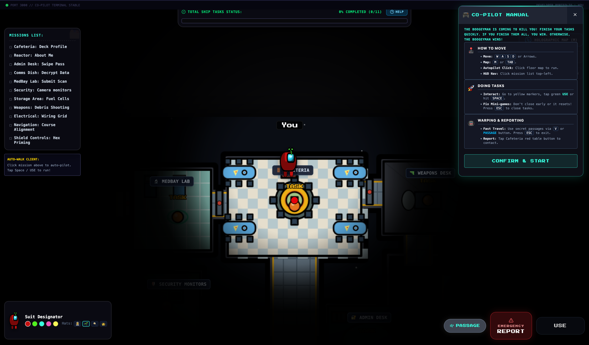
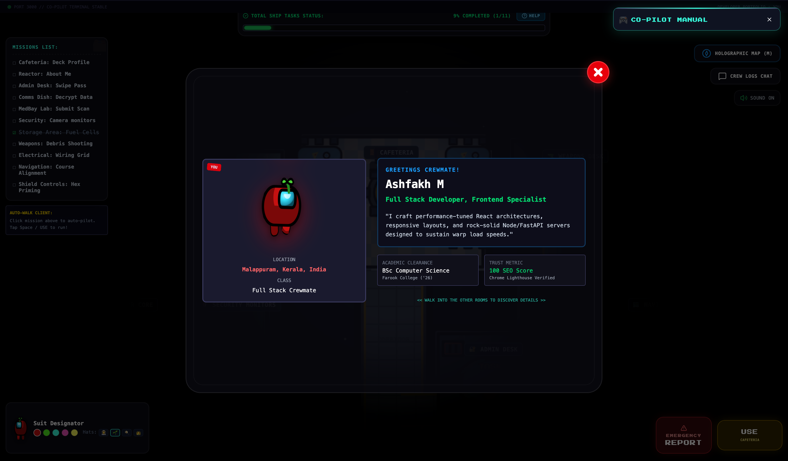

# 🚀 Amongus Inspired Developer Portfolio

_Turn static resume reading into an engaging 5-minute interactive mission that showcases real-world front-end engineering depth._

[](https://vite.dev)
[](https://react.dev)
[](https://www.typescriptlang.org)
[](https://github.com/ashfakhm/portfolio)

[⚡ Live Demo](https://portfolio-ashfakh-ms-projects.vercel.app/) • [📖 Documentation](#performance--architectural-highlights)

---

<p align="center">
  
</p>
<p align="center">
  
</p>

---

## Why Impostor Protocol Exists

Recruiters and hiring managers spend an average of 6 seconds reviewing a developer's resume. Most portfolios are static templates that fail to show true engineering capabilities, causing outstanding developers to be overlooked in a sea of identical profiles.

_Impostor Protocol_ solves this by turning the hiring process into a 5-minute gamified mission. By interacting with mini-game tasks, visitors actively explore professional achievements, while the underlying code showcases rigorous performance optimization (like 0fps idle rendering and memoized SVG paths) that is impossible to convey through bullet points alone.

---

## Key Capabilities

- **⚡ Gamified Exploration:** Discover skills, projects, and work experience by completing interactive "Among Us" themed tasks. Each completed task unlocks a detailed dossier containing my professional resume sections.
- **🎨 Live Crewmate HUD Customizer:** Dynamically customize crewmate suit colors and hats inside the spaceship HUD with instant vector previews.
- **🚀 Zero Re-render Idle State:** Optimized state subscriptions using Zustand shallow selectors reduce React render cycles from 60fps to 0fps when the crewmate is idle.
- **🌌 Dynamic 3D Starfield:** An immersive 3D space canvas powered by Three.js that is computationally optimized to prevent main-thread lag.
- **🎵 Procedural Sound Synthesis:** Built-in synthesizer utilizing the browser's native Web Audio API for interactions, completions, and jumpscares—requiring zero external audio assets.

---

## Interactive Gameplay & Movement Mechanics

The application functions essentially as a gamified developer **Todo List** (or task checklist). Navigating the spaceship and completing the listed tasks reveals different parts of the developer's resume and portfolio dossiers.

### 🕹️ Keyboard Listener & Grid Translation

The core movement engine registers active event listeners on the `window` to track user keyboard input, translating the crewmate along the coordinate axes:

- **W / ArrowUp**: Decrements the character's position along the **Y-axis** (translates the crewmate upwards).
- **S / ArrowDown**: Increments the character's position along the **Y-axis** (translates the crewmate downwards).
- **A / ArrowLeft**: Decrements the character's position along the **X-axis** (translates the crewmate leftwards, flipping the sprite direction).
- **D / ArrowRight**: Increments the character's position along the **X-axis** (translates the crewmate rightwards).

### 🏃 Walking Sprite Animation

To simulate fluid movement without heavy video assets, the engine tracks the velocity state of the crewmate:

- **Idle state**: React render loops are suspended at 0fps for maximum efficiency.
- **Walking state**: The engine switches character sprite visual states (animating leg poses and body bounce cycles sequentially like flipbook frames) to create a fluid, retro-style walking animation.

---

## Quick Start (60-Second Setup)

Get the spaceship's systems up and running locally in three simple steps:

### Step 1: Clone the repository

```bash
git clone https://github.com/ashfakhm/portfolio.git
cd portfolio
```

### Step 2: Install dependencies

```bash
npm install
```

### Step 3: Run the local dev server

```bash
npm run dev
```

Open your browser and navigate to the local server address (usually `http://localhost:3000`).

---

## Concrete Usage & Examples

Impostor Protocol decouples game logic from rendering using custom hooks. When a user completes a mini-game task, the UI conditionally hides the game panel and reveals a dossier card sharing details about my professional background:

### 1. Hook State Logic (`useElectricalTask.ts`)

The hook manages wire connections and triggers Web Audio SFX on state transitions:

```typescript
import { useState } from "react";
import { playSuccessTune, synthSFX } from "../../../utils/sound";

export function useElectricalTask({ onComplete, isCompleted }) {
  const [wireConnections, setWireConnections] = useState<
    Record<string, string>
  >({});
  const [activeWireDrag, setActiveWireDrag] = useState<string | null>(null);

  const handleRightWireClick = (color: string) => {
    if (!activeWireDrag) return;
    if (activeWireDrag === color) {
      setWireConnections((prev) => {
        const next = { ...prev, [color]: color };
        if (Object.keys(next).length === 4) {
          onComplete();
          playSuccessTune(); // Plays Web Audio C-E-G-C game victory chord
        }
        return next;
      });
      synthSFX.playBeep();
      setActiveWireDrag(null);
    } else {
      synthSFX.playTone(160, "square", 0.2, 0.05); // Error tone
      setActiveWireDrag(null);
    }
  };

  return { wireConnections, activeWireDrag, handleRightWireClick };
}
```

### 2. Component Rendering (`ElectricalTask.tsx`)

Once all wires are connected, the interface transitions from the matching game board to a dossier detailing my backend routing skills:

```typescript
import { useElectricalTask } from "./hooks/useElectricalTask";

export default function ElectricalTask({ onComplete, isCompleted }) {
  const { wireConnections, activeWireDrag, handleRightWireClick } = useElectricalTask({
    onComplete,
    isCompleted,
  });

  const isTaskFinished = Object.keys(wireConnections).length >= 4;

  return (
    <div className="task-container">
      {!isTaskFinished ? (
        <WireMatchGame onRightClick={handleRightWireClick} ... />
      ) : (
        <div className="dossier-card border border-lime-500/20 bg-lime-950/10 p-4">
          <h4 className="text-lime-400 font-mono">INTEGRATED STACK SWITCHES</h4>
          <p className="text-slate-300">
            Connections verified! Just like aligning electrical routes, Ashfakh designs
            fault-tolerant codebases, plugging RESTful endpoints cleanly into distributed datastores.
          </p>
        </div>
      )}
    </div>
  );
}
```

### Expected State Outputs

```json
// State of wireConnections after completing task:
{
  "red": "red",
  "blue": "blue",
  "yellow": "yellow",
  "pink": "pink"
}
```

---

## Performance & Architectural Highlights

The codebase is engineered to follow professional standards, featuring clean, robust, and optimized React 19 architecture:

- **Optimized Zustand Subscriptions**: All state subscriptions use shallow selectors or granular subscriptions to prevent redundant React component updates.
- **Condition-based Overlay Rendering**: Large panels (such as `HologramMap`, `VentMap`, and `ChatSystem`) are conditionally mounted inside `App.tsx` instead of constantly being rendered and hidden, minimizing active state listeners and reducing memory footprint.
- **Interactive SVG Map Memoization**: The `HologramMapView` interactive SVG component is wrapped in `React.memo` and coordinates auto-walk callbacks referentially through stable dependencies, minimizing SVG DOM mutations during walking.
- **Effect-Free React Architecture**: Avoided fragile `useEffect` state-syncing bugs by using derived states (e.g., in Shields and Weapons tasks) to ensure a robust, side-effect-free, and predictable user experience.

---

## Directory Structure

```text
portfolio/
├── public/                 ← Static assets (favicon, screenshots)
├── src/
│   ├── components/         ← React UI Components
│   │   ├── hud/            ← HUD Panels (victory screen, status bar, joystick)
│   │   ├── portfolio/      ← Resume Data Sections (experience, projects)
│   │   └── tasks/          ← Interactive Task Mini-Games
│   ├── hooks/              ← Core Player Engine & Game Loop orchestrators
│   ├── store/              ← State management (Zustand)
│   └── utils/              ← Canvas renderer and Sound Synthesizer
│   ├── App.tsx             ← Main game loop and orchestration
│   └── main.tsx            ← Entry point
├── package.json            ← Dependencies & build scripts
└── tsconfig.json           ← TypeScript configuration
```
